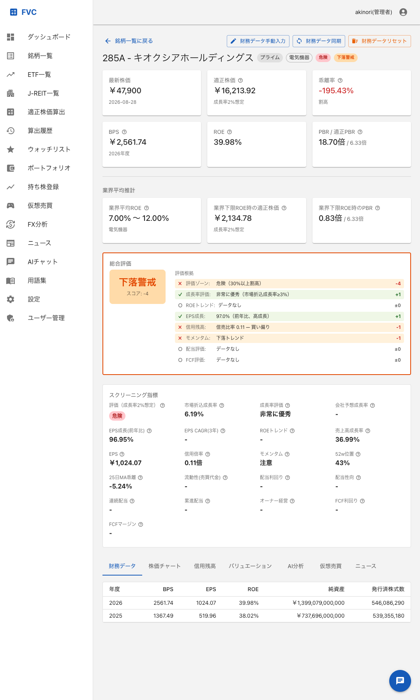
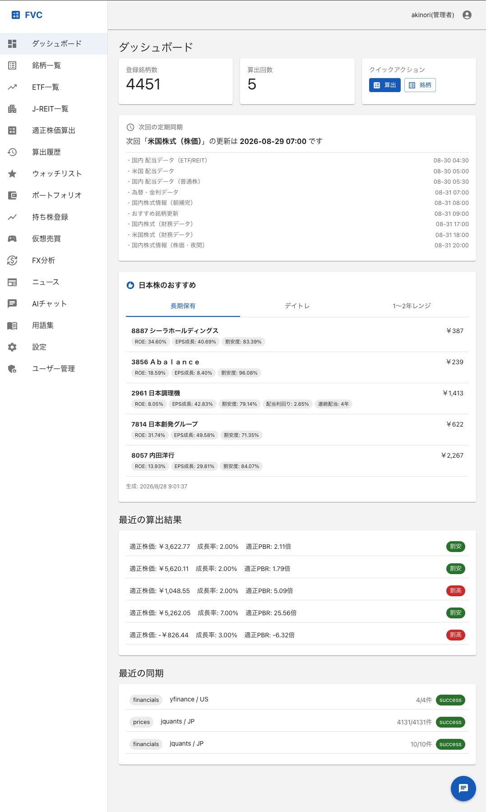
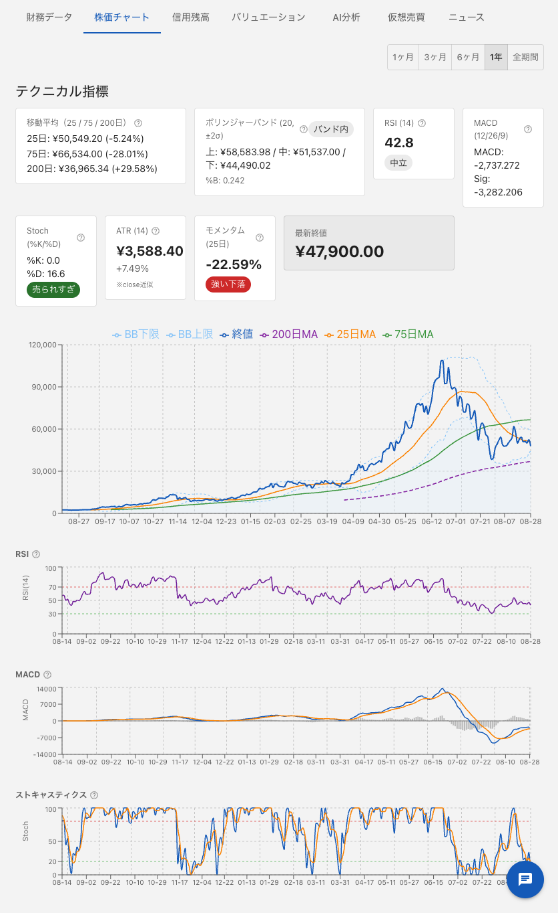

# FVC — Fair Value Calculator

**「この株は、理論的に割安か？」を数式で答えるWebアプリ。**

ROE・成長率・資本コストを入力すると、ゴードン成長モデル（残余利益モデル）で**理論PBR・適正株価**を算出し、現在株価と並べて「割安〜危険域」の6段階で評価します。さらに、現在のPBRから**市場が織り込んでいる期待成長率を逆算**したり、成長率別の適正株価レンジを一覧化したりと、"感覚"ではなく"根拠"で銘柄を見るための道具です。

<p>
  
  
  
  
  
  
</p>

> 本リポジトリは非公開の開発リポジトリから、リリース時点のスナップショットを公開しているミラーです（コミット履歴はリリース単位）。



<p>
  
  
</p>

## なぜ作ったか

株価が「割安か割高か」の判断は、多くの場合PERやPBRを"なんとなく"眺めて終わりがちです。FVCは、**残余利益モデルという1本の理論**を軸に、入力（ROE・成長率・資本コスト）から出力（適正株価）までを一貫した数式で貫くことで、判断の根拠を明示できるようにしました。「なぜその株価が適正なのか」を、感覚ではなくモデルで説明できるのが狙いです。

## 主な機能

| 機能 | 説明 |
|------|------|
| 適正PBR算出 | ROE・成長率・資本コストから理論PBRを算出 |
| 適正株価算出 | BPS × 適正PBR で理論株価を提示 |
| 株価評価 | 現在株価を「割安〜危険域」の6段階で評価 |
| 逆算分析 | 現在のPBRから市場が織り込む期待成長率を逆算 |
| シナリオ分析 | 成長率別の適正株価レンジを一覧表示 |
| 米国基準比較 | 米国市場基準のPBRと比較しバブル領域を警告 |
| ポートフォリオ管理 | 保有銘柄の評価・スナップショット・ダッシュボード |
| テクニカル指標 | 移動平均等の指標表示とスクリーニング |
| MCP サーバー | AIエージェント（Claude 等）から対話的に呼び出せる MCP ツール群 |

理論モデルの詳細は [docs/design/app-specification.md](docs/design/app-specification.md) を参照してください。

## 技術的な見どころ

- **Clean Architecture を Django に持ち込む** — View → UseCase → Service → Repository の一方向依存を徹底し、Domain 層は Django ORM/DRF を一切 import しない。依存解決は DIコンテナ（`config/container.py`）に集約。
- **AIエージェントから使える MCP サーバー** — Claude 等の AIエージェントが、株価評価やポートフォリオ分析を対話的に呼び出せる MCP ツールを同梱。
- **サーバーレス本番構成を Terraform で** — CloudFront + S3（SPA）／API Gateway + Lambda（Django on Mangum）／RDS を IaC で完全管理。株価は EventBridge Scheduler で平日定期同期。

```
HTTP Request
  → Presentation (View / Serializer)
  → UseCase（オーケストレーション + @transaction.atomic）
  → Service（単一責任のビジネスロジック）
  → Repository ABC（インターフェース）
  → Repository Impl（Django ORM）
  → Model → DB
```

| ルール | 説明 |
|--------|------|
| View → UseCase のみ | View は Service を直接呼び出さない |
| UseCase = オーケストレーション | Service の組み合わせ + `@transaction.atomic` |
| Service = 単一責任 | 他の Service を呼び出さない |
| Domain = 外部依存ゼロ | Django ORM / DRF を import しない |
| DI Container 経由 | 依存解決は `config/container.py` に集約 |

## 技術スタック

| カテゴリ | 技術 |
|---------|------|
| バックエンド | Python 3.14 / Django 6.0 / Django REST Framework |
| フロントエンド | React 19 (TypeScript) / Vite / TanStack Query / Zustand |
| DB | MySQL 8.0 |
| コンテナ | Docker / Docker Compose |
| IaC | Terraform（AWS: Lambda / API Gateway / CloudFront / RDS / EventBridge ほか） |
| 認証 | Amazon Cognito (OAuth) |
| CI/CD | GitHub Actions（lint / test / type-check → 自動デプロイ） |

## クイックスタート

```bash
cp .env.example .env   # 必要な値を設定
make up                # コンテナ起動（backend / frontend / db / phpmyadmin / swagger）
make migrate           # マイグレーション
make seed              # 初期データ投入（管理ユーザーの認証情報はコマンド実行時に表示されます）
```

- フロントエンド: http://localhost:3000
- API: http://localhost:18000
- Swagger UI: http://localhost:18081
- その他のコマンドは `make help` を参照

## データソースについて

株価・財務データの取得は利用者自身の環境・手段で行う構成です。各データ提供元の利用規約に従ってください。本リポジトリは市場データそのものを含みません。

## 免責事項

本アプリケーションは株式評価の理論値を計算する**ツール**であり、投資助言・投資勧誘ではありません。算出結果は理論モデルに基づく参考値であり、正確性・完全性を保証しません。投資判断はご自身の責任で行ってください。

## ライセンス

[MIT](LICENSE)
